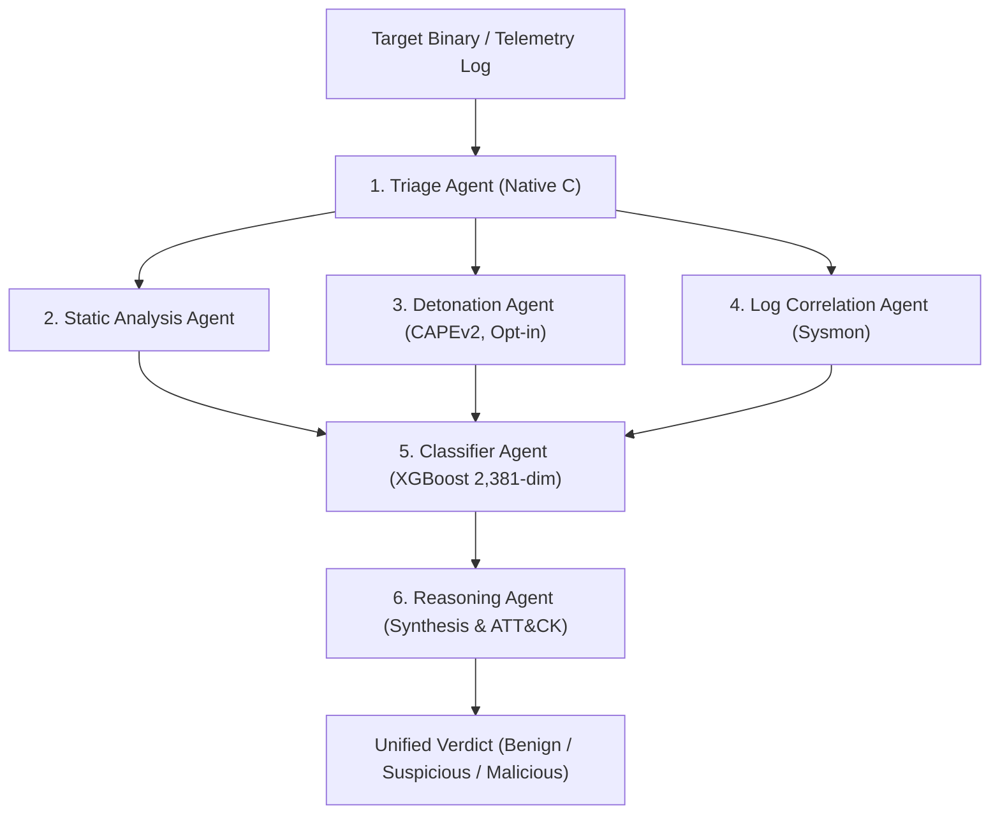

---
tags:
  - architecture
  - pipeline
  - multi-agent
title: "Nullify Multi-Agent Pipeline"
date: 2026-09-13
---

# 🤖 The 6-Agent Pipeline Architecture

Nullify uses a modular multi-agent pipeline where specialized agents evaluate distinct layers of evidence. The results are unified into a single `AnalysisResult` that both the Web UI and CLI consume identically.

---

## The Six Cooperating Agents

| Agent | Core Function | Speed | Key Output |
| :--- | :--- | :---: | :--- |
| **[[Agent - Triage\|1. Triage]]** | Native C hash computation, magic byte sniffing, Shannon entropy. | $< 15\text{ ms}$ | Architecture, MD5, SHA-256, packing flags. |
| **[[Agent - Static Analysis\|2. Static Analysis]]** | Dissects PE/ELF headers, sections, suspicious API imports, YARA. | $\sim 50\text{ ms}$ | Section anomalies, dangerous Windows APIs. |
| **[[Agent - Dynamic Detonation\|3. Detonation]]** | External sandbox execution (CAPEv2) under opt-in `--deep`. | $2\text{--}5\text{ min}$ | Runtime drops, registry mutations, network beacons. |
| **[[Agent - Log Correlation\|4. Log Correlation]]** | Reconstructs Sysmon and Windows EVTX event telemetry. | $\sim 100\text{ ms}$ | Process trees, command-line flags, C2 connections. |
| **[[Agent - Classifier\|5. Classifier]]** | Evaluates 2,381-dim EMBER feature vector via XGBoost. | $\sim 15\text{ ms}$ | $P(\text{malicious})$ probability & confidence. |
| **[[Agent - Reasoning\|6. Reasoning]]** | Evidence synthesis, threat family attribution, YARA synthesis. | $\sim 80\text{ ms}$ | Plain-English summary, ATT&CK IDs, YARA rule. |

---

## Shared Event Bus
Every agent emits typed findings (`Finding`) containing:
- `title`: Short human-readable summary
- `detail`: Technical specifics (e.g. `entropy=7.89 >= 7.80`)
- `severity`: `INFO`, `LOW`, `MEDIUM`, `HIGH`, `CRITICAL`
- `mitre_ids`: Standardized ATT&CK technique IDs (e.g. `["T1027", "T1055"]`)
- `metadata`: Key-value properties for programmatic inspection

---

## Related Notes
- [[Agent - Triage|Agent 1: Triage]]
- [[Agent - Static Analysis|Agent 2: Static Analysis]]
- [[Agent - Dynamic Detonation|Agent 3: Detonation]]
- [[Agent - Log Correlation|Agent 4: Log Correlation]]
- [[Agent - Classifier|Agent 5: Classifier]]
- [[Agent - Reasoning|Agent 6: Reasoning]]
- [[05 - Machine Learning/Verdict Fusion Logic|Verdict Fusion Logic]]
